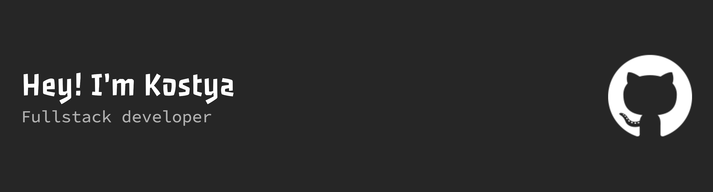

<!-- <h1 align="left">👋 Hi, I'm Kostya!</h1> -->

Hey there! I'm a 9th grade student passionate about web development. I love exploring new technologies, building projects, and sharpening my coding skills every day. Always excited to take on challenges and grow as a developer! 🚀 

<h2 align="center">💫 About Me</h2>

🏫 Student 
💻 Frontend Developer (React & Node.js) 
🛠️ Learning JavaScript, Rust, and Full-Stack Development 
🎨 Passionate about creating clean and user-friendly interfaces 
🌱 Always exploring new tools and frameworks 
📚 Curious, ambitious, and ready for challenges

<h2 align="center">💻 Tech Stack</h2>

  

<h2 align="center">📊 GitHub Stats</h2>

  

